本系统的大致功能范围
1）客户端要求：
a.自助查询：用户可以通过输入文字或语音提问，系统自动识别问题意图，并让AI从知识库中查找相关信息，返回答案
b.智能推荐：根据用户的查询历史和个人偏好，系统主动推送相关的信息或解决方案
c.人工客服：当AI无法解答某些特定问题时，用户可以直接转接到人工客服，进行进一步的沟通
d.满意度反馈：用户可以对每次服务进行评价，帮助系统不断改进服务质量
2）人工客服端要求：
a.用户登录，客服通过管理员提供的账号进行登录。
b.互动交流，客服与客户可进行基本的交流
c.AI辅助回答，AI读取客服与客户的沟通记录并根据知识库实时生成可能的解决方案
d. AI生成图谱，AI实时生成相关的知识关系图，方便客服进行进一步的手动查询
e.对话历史查看，客服可以管理查看与客户的对话历史。
3）后台管理要求：
a.管理员登录，管理员可以通过特定权限登录后台管理系统。
b.用户管理，添加删除并设置不同级别的账户权限
b.编辑知识库，管理员可以为系统添加背景知识、产品文档等
c.数据分析，通过分析用户的查询记录，发现高频问题，优化知识图谱结构，提高系统性能

相关技术：
前端：HTML + CSS + TypeScript + Vue.js + TailwindCSS + DaisyUI
后端：Node.JS + TypeScript + PostgreSQL + Prisma + MinIO
AI/知识图谱：Ollama + Qwen2.5 + LangChain + Weaviate
CI/CD：Git + GitHub Actions + Docker

注：
知识图谱将以mermaid格式存储在PostgreSQL里
Weaviate是向量数据库 用于存储向量化的文档 
Ollama是AI组件 
向Ollama请求前需要向Weaviate请求

```json
{
  "theme": "base",
  "themeVariables":{
    "primaryColor":"#FFFFFF",
    "primaryBorderColor":"#000000"
  }
}
```

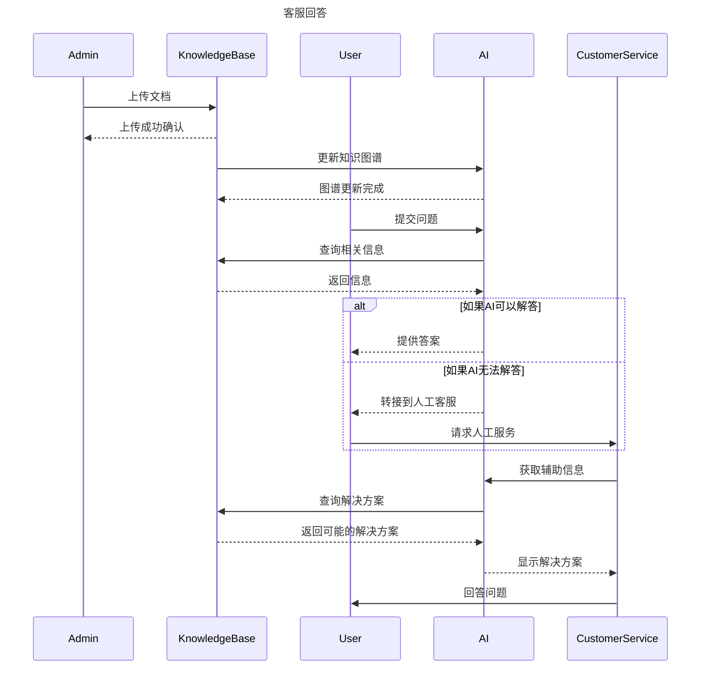

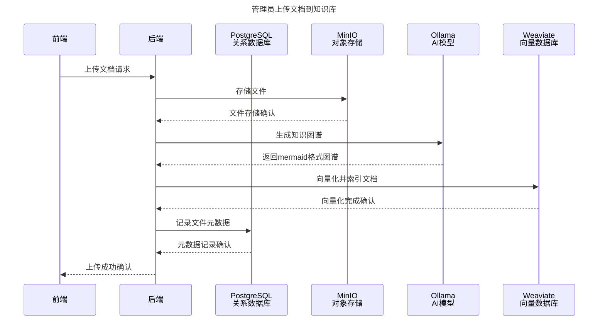

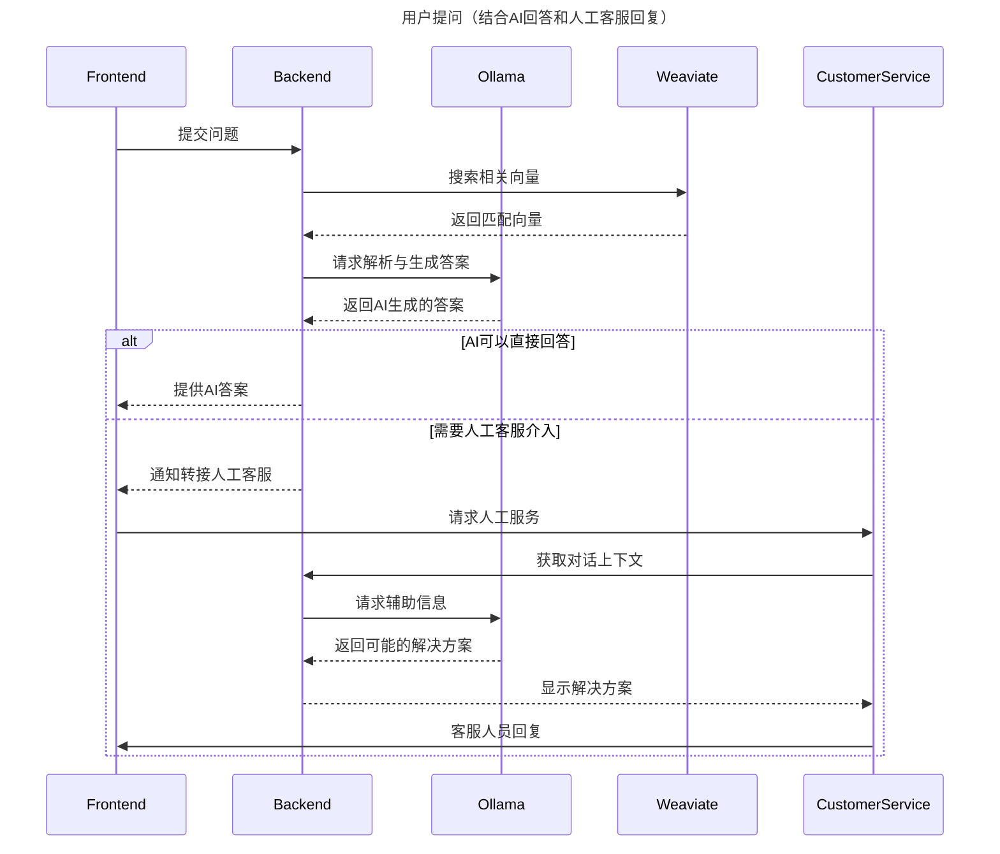

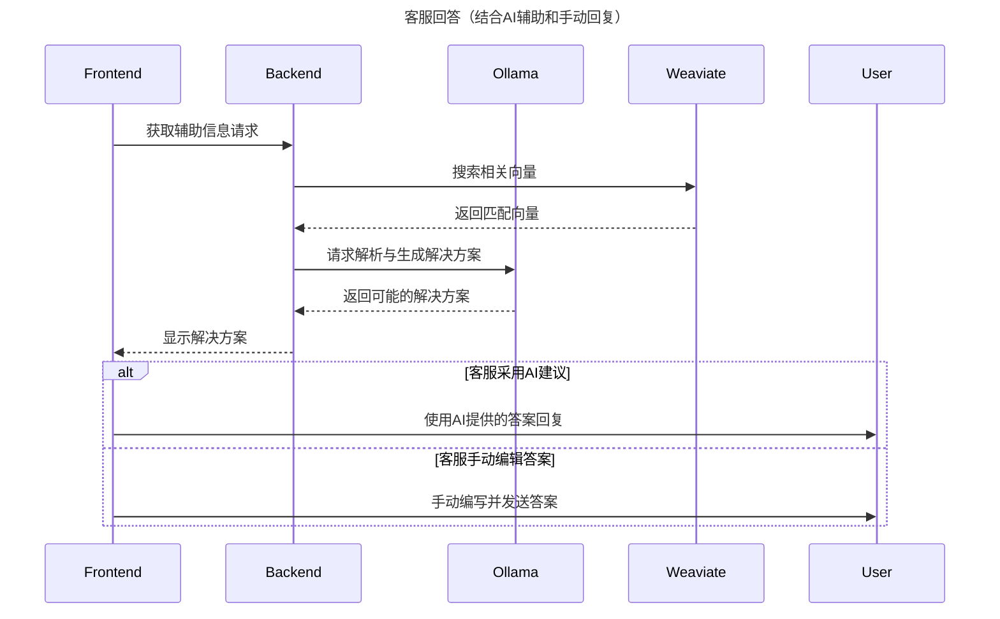


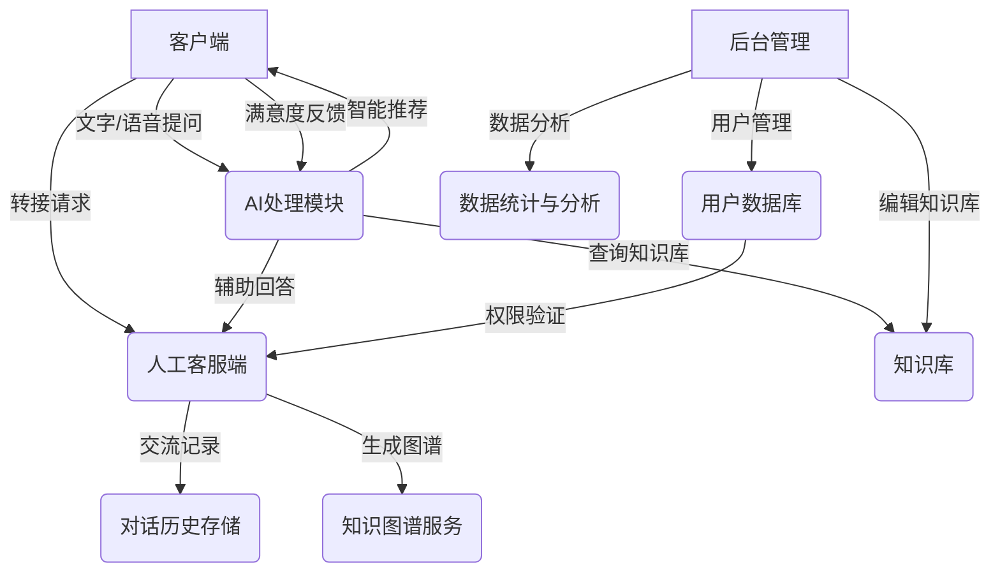

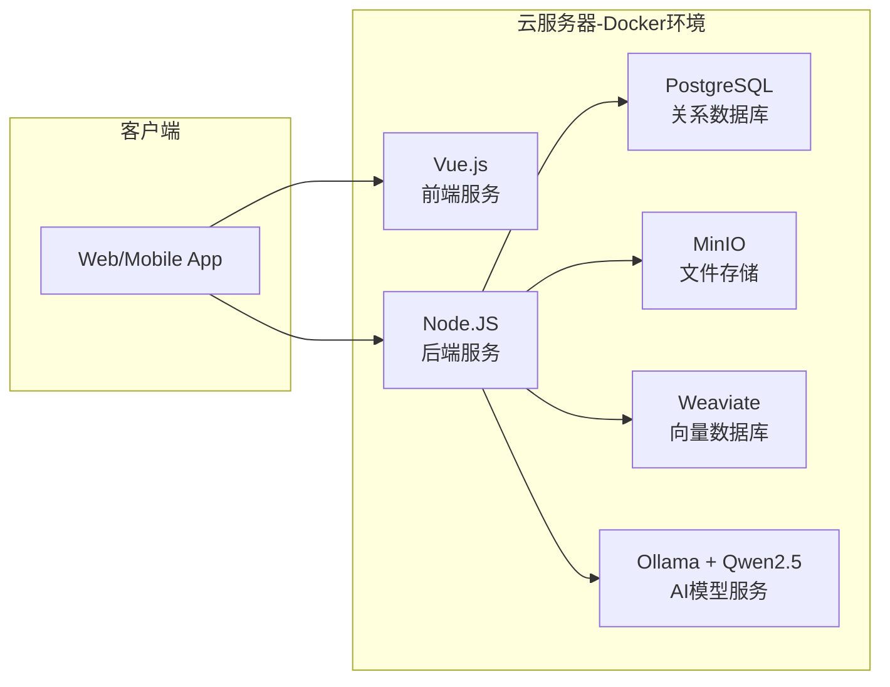

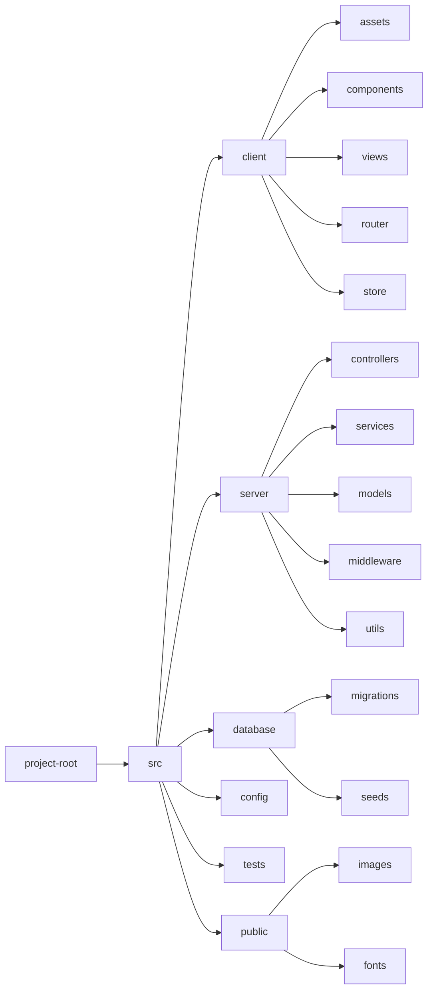

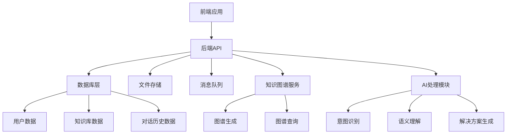

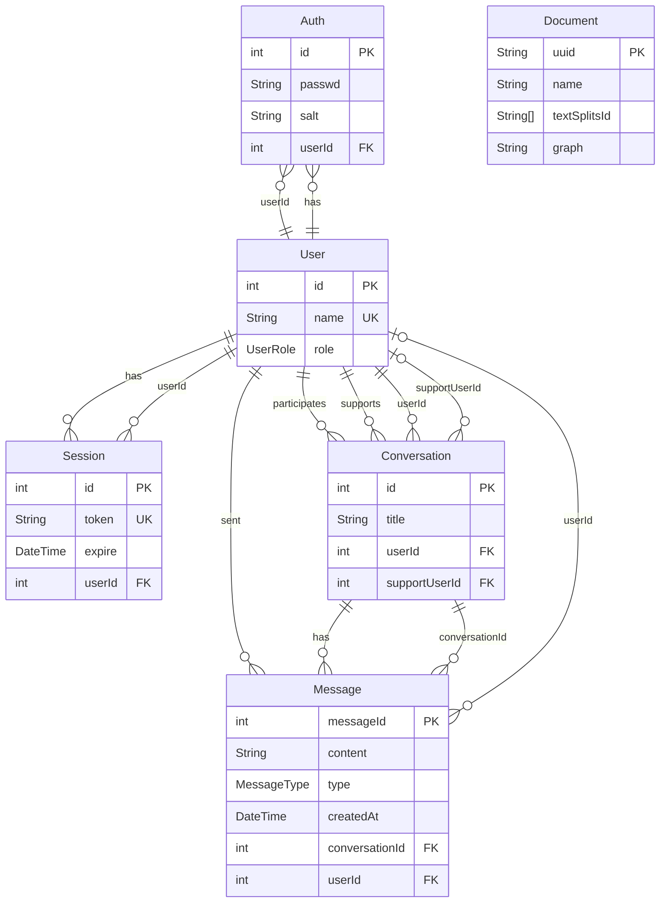

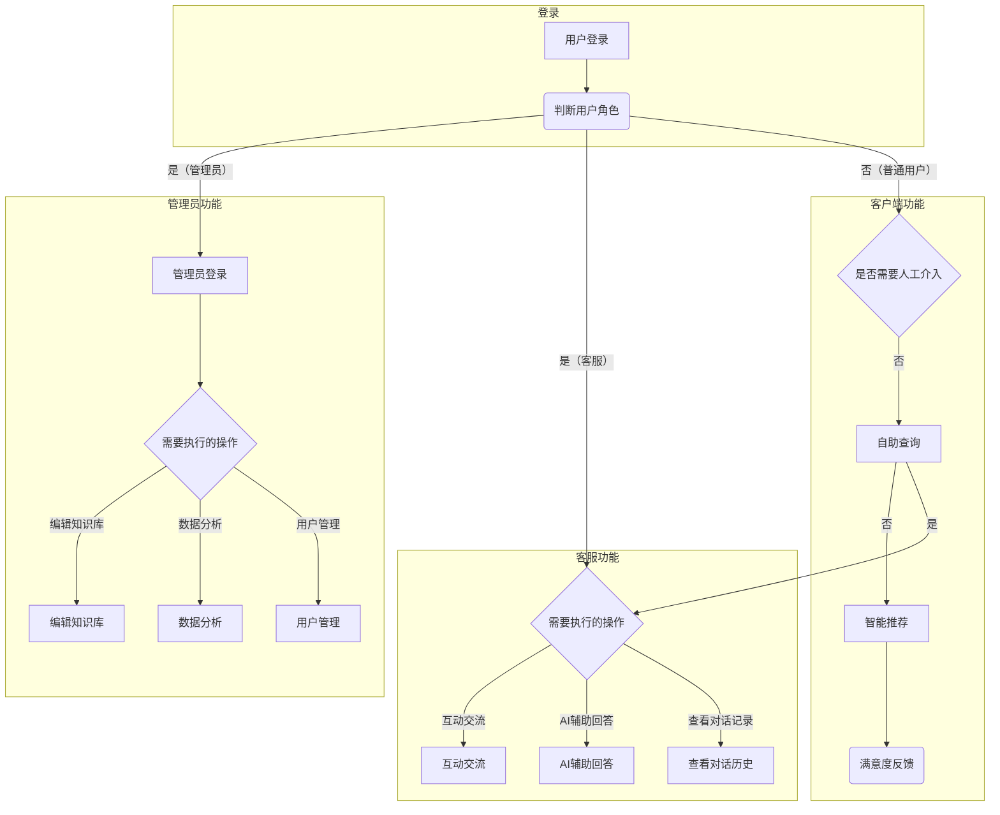

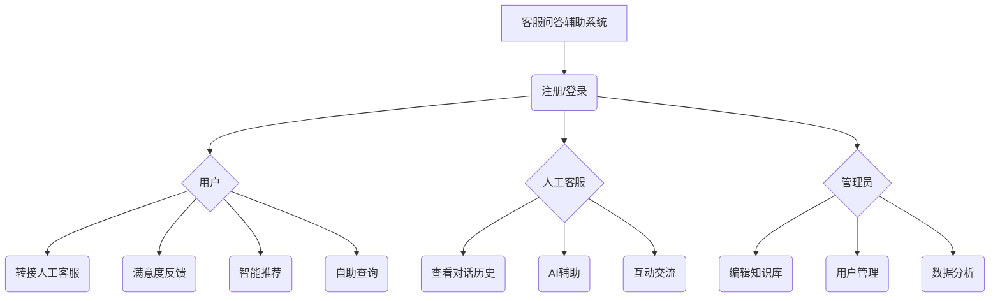

```mermaid
%% 系统类图
classDiagram
    class Hono {
        +get(path: string, handler: function)
        +post(path: string, handler: function)
        +delete(path: string, handler: function)
        +put(path: string, handler: function)
        +use(middleware: function)
    }

    class User {
        +id: number
        +name: string
        +role: UserRole
    }

    class Conversation {
        +id: number
        +title: string
        +userId: number
        +supportUserId: number
    }

    class Message {
        +id: number
        +conversationId: number
        +content: string
        +type: MessageType
        +userId: number
    }

    class Document {
        +uuid: string
        +name: string
        +textSplitsId: string[]
        +graph: string
    }

    class PrismaClient {
        +document: Document
        +conversation: Conversation
        +message: Message
        +user: User
    }

    class WeaviateClient {
        +collections: Collection
    }

    class Collection {
        +listAll(): Promise
        +delete(name: string): Promise
        +get(name: string): Collection
        +iterator(): AsyncIterator
    }

    class Langchain {
        +splitDocuments(docs: Document[]): Promise
        +stream(input: string, options: object): AsyncIterator
    }

    class CallbackHandler {
        +publicKey: string
        +secretKey: string
        +baseUrl: string
    }

    class PDFLoader {
        +load(): Promise
    }

    class RecursiveCharacterTextSplitter {
        +splitDocuments(docs: Document[]): Promise
    }

    class ChineseRecursiveTextSplitter {
        +splitDocuments(docs: Document[]): Promise
    }

    class ChatOpenAI {
        +model: string
    }

    class ChatOllama {
        +model: string
    }

    class ChatPromptTemplate {
        +fromMessages(messages: string[]): ChatPromptTemplate
    }

    class EnsembleRetriever {
        +retrievers: Retriever[]
        +weights: number[]
    }

    class WeaviateStore {
        +addDocuments(docs: Document[]): Promise
        +asRetriever(options: object): Retriever
    }

    class Retriever {
        +retrieve(query: string): Promise
    }

    class SSEStreamingApi {
        +writeSSE(event: object)
        +close(): Promise
    }

    class WSContext {
        +send(data: string)
        +readyState: number
    }

    class WebSocketResponseEvent {
        +type: string
        +data: object
    }

    Hono --> PrismaClient
    Hono --> WeaviateClient
    Hono --> Langchain
    Hono --> CallbackHandler
    Hono --> SSEStreamingApi
    Hono --> WSContext

    PrismaClient --> User
    PrismaClient --> Conversation
    PrismaClient --> Message
    PrismaClient --> Document

    WeaviateClient --> Collection

    Collection --> Document

    Langchain --> RecursiveCharacterTextSplitter
    Langchain --> ChineseRecursiveTextSplitter
    Langchain --> ChatOpenAI
    Langchain --> ChatOllama
    Langchain --> ChatPromptTemplate
    Langchain --> EnsembleRetriever
    Langchain --> WeaviateStore

    RecursiveCharacterTextSplitter --> Document
    ChineseRecursiveTextSplitter --> Document

    ChatPromptTemplate --> Retriever

    EnsembleRetriever --> Retriever

    WeaviateStore --> Document
    WeaviateStore --> Retriever

    SSEStreamingApi --> WebSocketResponseEvent
    WSContext --> WebSocketResponseEvent
```